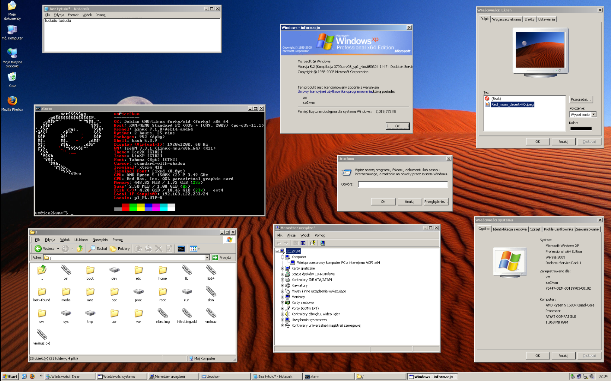

```
THIS IS A FORK of Ice2k to translate it to Polish.
Original description below:

Ice2K/XP.sys
=================================

WHAT'S THIS?
A small desktop environment for GNU/Linux that looks like Windows 2000/XP.
It doesn't have it's own window manager right now (it uses IceWM).

The source code is kinda messy. I plan on rewriting a majority in C(++).
I might have forgotten to put some things here (the source tree is all
around my home folder... I'm trying to organize it)


INSTALLATION?
You should use a fresh Debian 13 installation. I have tested this with only
a fresh Debian 13 installation without any DE/WM installed.

It may work on other Debian-based distros but I haven't tested that.

Run the following:
    sudo apt-get install git ca-certificates
    git clone https://github.com/comdlg32/ice2k
    cd ice2k
    ./installer.sh
    cd ..
    startx

You can run most of the programs included from the source tree.
I'll make proper .desktop files for those soon.

I had to kind of rush this, expect bugs.

I am not responsible for any kind of damage to your computer. You should
probably not test this on your main computer for now, you can lose
data (unlikely. however you are most likely to lose dotfiles)

MAIN AUTHORS
xcomposite (me)
https://johnconnection.neocities.org/ (https://github.com/johnconnection )
(he worked on some things, but I rewritten his code when I moved
majority of Ice2K.sys to FOX toolkit)

CREDITS
Thanks to enfaun and PixelOCDGuy for base of IceWM theme
Thanks to enfaun for GTK3 theme
Thanks to ohno for helping a bit out with my code
Thanks to zippy for testing
Thanks to the XFE project for the base of the file manager
Thanks to rozniak for porting XP/2K cursors
http://roland65.free.fr/xfe/
Thanks to nestoris for SE98 icon theme
Thanks to b00merang for linxp icon theme
Thanks to the FOX toolkit contributors for contributing to the FOX project,
some code of it is being used here, and it's the main GUI toolkit of this
project.
Thanks to https://github.com/travy-patty for logo and branding

Thanks to the developers of the IceWM project
Thanks to https://sillycycle.com/xlockmore.html for working on xlockmore
all these years
Thanks to Microsoft for their icons/assets/design

If I forgot to credit someone, let me know.

Any of my code that I haven't put a license file in is licensed in the
GPLv2.
```
